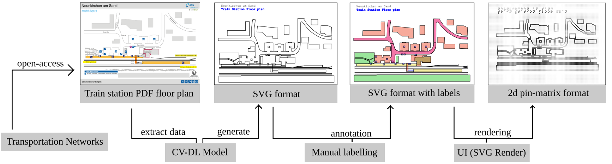
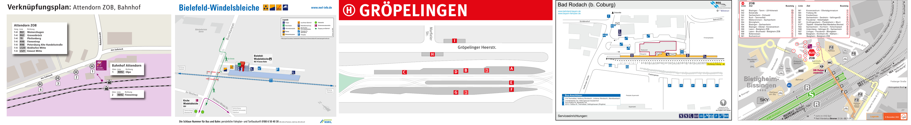

# Train Station🚉 Floor Plans Database


This repository is an open-access database of train station floor plans focused on Baden-Wuttemberg and Bavaria regions in Germany. It includes PDF and PNG formats of over 2800 train stations. The database aims to expand with floor plans from other European train stations, supporting transportation research and accessibility initiatives.

 Nuremberg Main Railway train station. (Collected from the [BEG](https://www.bayern-fahrplan.de/de/zusaetzliche-informationen/stationsdatenbank) database). 

## <span style="font-size:larger;">**Background**</span>
This project aims to provide a valuable resource for individuals with visual impairments by making train station floor plans accessible through audio-tactile representations. By converting the floor plans into SVG format, we can create tactile representations that can be interpreted through touch and sound, allowing individuals with BVI to navigate train stations independently and safely.




## <span style="font-size:larger;">**Dataset Structure**</span>

The dataset is organized as follows:

```markdown
root/
├── Germany/
│   ├── Baden-wuttermberg/
│   │   ├── station1/
│   │   │   ├── station1.png
│   │   │   ├── station1.pdf
│   │   │   └── ...
│   │   ├── station2/
│   │   │   ├── station2.png
│   │   │   ├── station2.pdf
│   │   │   └── ...
│   │   └── ...
│   ├── Bavaria/
│   │   ├── station1/
│   │   │   ├── station1.png
│   │   │   ├── station1.pdf
│   │   │   └── ...
│   │   ├── station2/
│   │   │   ├── station2.png
│   │   │   ├── station2.pdf
│   │   │   └── ...
│   │   └── ...
│   └── ...
└── ...
```


Our dataset is characterized by its diversity, encompassing a wide range of train stations with various architectural designs and layouts. Each train station has its own directory containing both PNG and PDF versions of the floor plans. As we continue expanding the database to include additional European train stations, the collection will further encompass a multitude of unique labels, representing the rich tapestry of railway infrastructure across the globe 🌍.



## Link dataset

To access the train station floor plans dataset, you can visit the following link: [[Zenodo](https://drive.google.com/drive/folders/1mb3frqlO70MktOJYpr-8I_btsUQ_3VbI)].

**August 2023 Version** - 2831 train stations - 7.70 GB. 

## Contribution Guidelines
Contributions to this project are welcome! If you have floor plans for train stations in other European regions, please follow these steps to contribute:

1. Fork the repository and create a new branch for your contributions.
2. Create a directory structure similar to the existing format for the corresponding country and district.
3. Add the floor plans in both PNG and PDF formats to the appropriate directory.
4. Create a pull request with a clear description of the changes made.

     
## Citation :page_with_curl:
If you use this dataset, please cite [[ACM paper](https://dl.acm.org/doi/abs/10.1145/3594806.3594839)]:
```
@inproceedings{10.1145/3594806.3594839,
author = {Ram\^{o}a, Gaspar and Moured, Omar and M\"{u}ller, Karin and Schwarz, Thorsten and Stiefelhagen, Rainer},
title = {Display and Use of Station Floor Plans on 2D Pin Matrix Displays for Blind and Visually Impaired People.},
year = {2023},
isbn = {9798400700699},
publisher = {Association for Computing Machinery},
address = {New York, NY, USA},
url = {https://doi.org/10.1145/3594806.3594839},
doi = {10.1145/3594806.3594839},
booktitle = {Proceedings of the 16th International Conference on PErvasive Technologies Related to Assistive Environments},
pages = {254–258},
numpages = {5},
keywords = {train station floor plans, information access, user interface design, blind and visually impaired, 2d refreshable pin-matrix displays, audio-tactile user interface},
location = {Corfu, Greece},
series = {PETRA '23}
}
